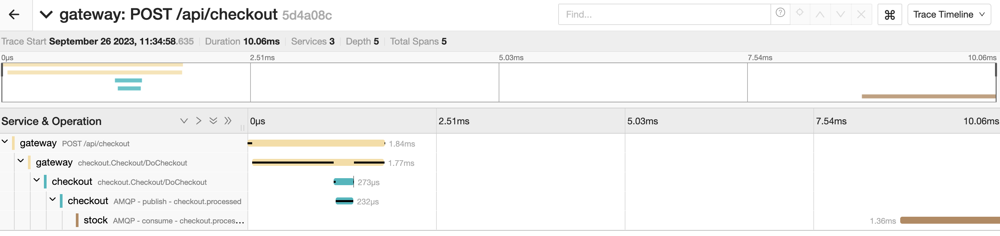

## Open Telemetry in Go example

This service contains a sample on how to use Open Telemetry exposing spans for HTTP, gRPC and AMQP.

You can find the two-series-post with the step by step [here](https://devandchill.com/posts/2021/12/go-step-by-step-guide-for-implementing-tracing-on-a-microservices-architecture-1/2/).

## How does it look in Jaeger

